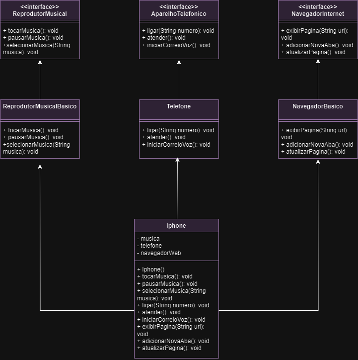

# Projeto Iphone
Desafio proposto no bootcamp Desenvolvimento Java com IA promovido pela DIO e a empresa GFT. 

Neste projeto coloquei em prática os conceitos de programação orientada a objetos e modelagem UML. Utilizei a ferramenta de modelagem Draw.io para elaborar a diagramação das classes e interfaces, representando as funções do iPhone como Reprodutor Musical, Aparelho Telefônico e Navegador na Internet. 

# Visualização do projeto:

